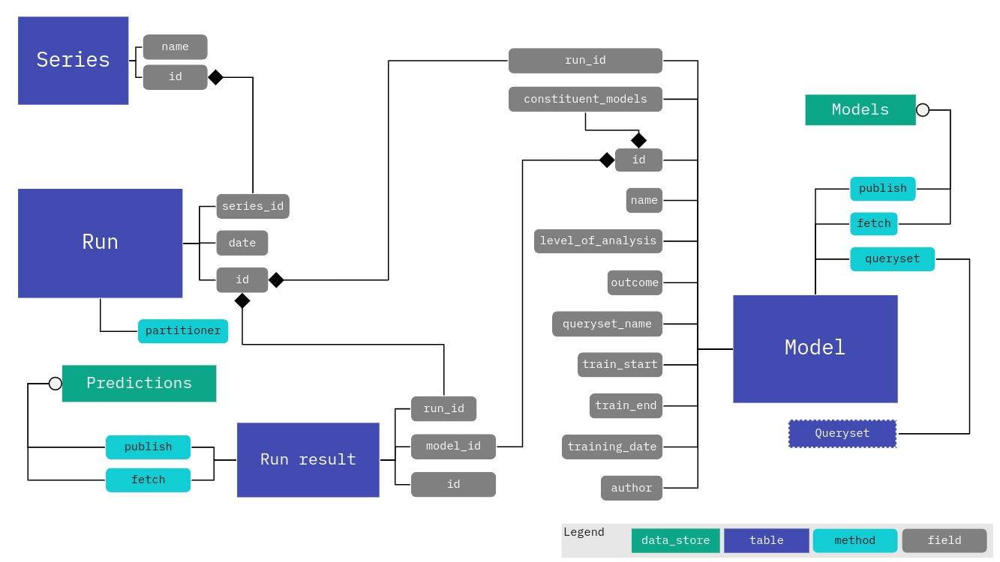

# Production run sketch

This repository combines pseudocode and diagrams to attempt a definition of
what's needed for ViEWS production runs.

The idea that's applied here is to let each component of a run be modelled as
data, with powerful methods that correspond to the various steps taken when
defining a run. Many of the methods will connect to a backend to retrieve data,
metadata and definitions, such as fetching data via viewser, fetching
periodization definitions, model objects, et cetera.

## Data model

